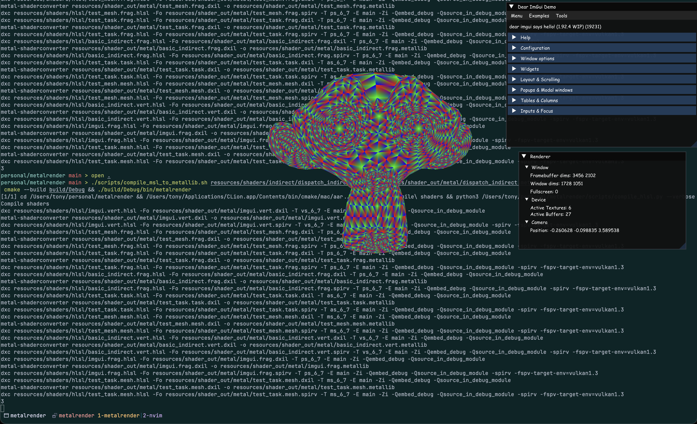

# Another Renderer

I've been working on this renderer to enlighten myself on the wonders
of the Metal API while I don't have access to a desktop. As of Jan 2026, I might be quitting this for now, since HLSL shader debugging in Xcode is quite lacking. As of later Jan 2026, I came back to this, since I once again was sentenced to MacOS only. My current work is inspiring me to continue this and add a Vulkan backend so the RHI is actually an RHI and is provably not leaky.

## The deal

The `pre_rhi` branch contains meshlet occlusion culling and primitive voxel rendering written in hardcoded Metal 3 as a learning experience.

The main branch is an ongoing attempt at a render hardware interface (RHI) wrapping Metal and eventually Vulkan to enable a single renderer path to run on multiple platforms. The new RHI approach uses HLSL and [metal-shaderconverter](https://developer.apple.com/metal/shader-converter/) to convert `dxil` directly to Metal IR (`metallib`). After half-arsing abstractions in my previous iterations, it's incredibly satisfying to write an entire pipeline without a single "metal" or "mtl" keyword.

The initial hard-coded Metal pipeline was written in Metal 3. I switched to Metal 4 for the first implementation of the RHI, only to realize it's practically unusable for anything beyond basic rendering due to a lack of GPU debugging support. I'm now supporting both Metal 3 and 4, since working without a GPU debugger/profiler is mega cursed.

Here's some out-of-date random Suzanne meshlets rendered with the old Metal 3 hard-coded pipeline:


Here's the first meshlet-rendered Suzanne with the new RHI, with a transparent window and [Comic Sans](https://en.wikipedia.org/wiki/Comic_Sans#Misuse) memery as a bonus:



## Running locally

```bash
git clone https://github.com/tonadr1022/metalrender
cd metalrender
git submodule update --init --recursive
cmake --preset Release
cmake --build build/Release

# Download glTF Sample Assets: https://github.com/KhronosGroup/glTF-Sample-Assets
./scripts/download_gltf_models.sh $HOME/gltf_sample_assets
# symlink so the default config file can find the models
ln -s $HOME/gltf_sample_assets/models/gltf ./resources/models/gltf
# run that thang
./build/Release/src/metalrender
```

## Current Features (probably out of date)

- RHI that actually doesn't contain API specific features, actually
- GPU driven rendering (no for loops on the CPU, (looking at you MoltenVK))
- meshlets
- meshlet occlusion, frustum, cone culling (`pre_rhi` branch)
- dynamic model loading/unloading

## References

- [Mesh Shaders and Meshlet Culling in Metal 3](https://metalbyexample.com/mesh-shaders/)
- [Zeux's Niagara Renderer](https://github.com/zeux/niagara)
- [Metal Shading Language](https://developer.apple.com/metal/Metal-Shading-Language-Specification.pdf)
- [DirectX-Graphics-Samples](https://github.com/microsoft/DirectX-Graphics-Samples)
- [The Maister's Render Graph Deep Dive](https://themaister.net/blog/2017/08/15/render-graphs-and-vulkan-a-deep-dive/)
- [My previous Vulkan renderer VkRender2](https://github.com/tonadr1022/vkrender2)
- [WickedEngine](https://wickedengine.net/)

## Third Party Libraries

- [cgltf](https://github.com/jkuhlmann/cgltf)
- [glfw](https://github.com/glfw/glfw)
- [glm](https://github.com/g-truc/glm)
- [imgui](https://github.com/ocornut/imgui)
- [meshoptimizer](https://github.com/zeux/meshoptimizer)
- [metal-cpp](https://developer.apple.com/metal/cpp/)
- [metal-shaderconverter](https://developer.apple.com/metal/shader-converter/)
- [stb_image](https://github.com/nothings/stb)
- [tracy](https://github.com:wolfpld/tracy)
- [OffsetAllocator](https://github.com/sebbbi/OffsetAllocator)

## TODO

- everything else
