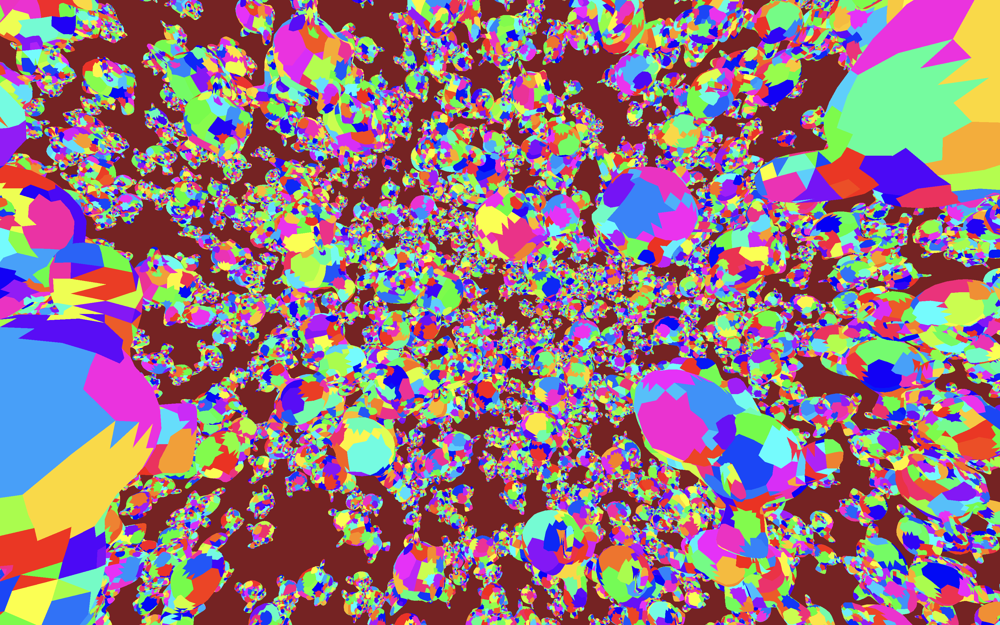

# Metal Renderer (maybe minecraft 2)

I've been working on this renderer to enlighten myself on the wonders
of the Metal API while I don't have access to a desktop.
So far, it's been focused on meshlet rendering, with the possibility to expand it into Minecraft 2 (LOL).



## Running locally

```bash
git clone https://github.com/tonadr1022/metalrender
cd metalrender
git submodule update --init --recursive
cmake --preset Release
cmake --build build/Release
./bin/Release/metalrender
```

- Use CMake presets

## Current Features

- meshlets
- meshlet frustum and cone culling
- dynamic model loading

## References

- [Mesh Shaders and Meshlet Culling in Metal 3](https://metalbyexample.com/mesh-shaders/)
- [Zeux Niagara Renderer](https://github.com/zeux/niagara)

## TODO

- reserve sizes in model load
- meshlet occlusion culling
