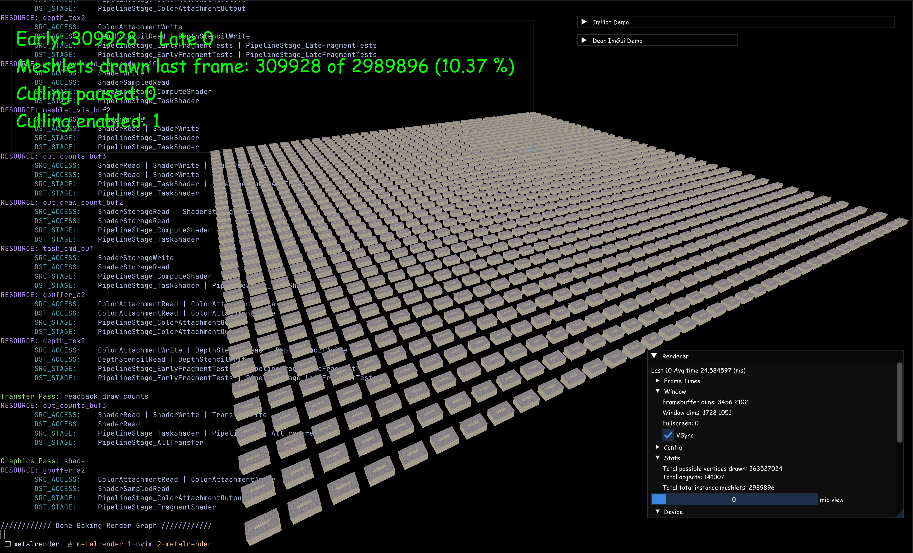
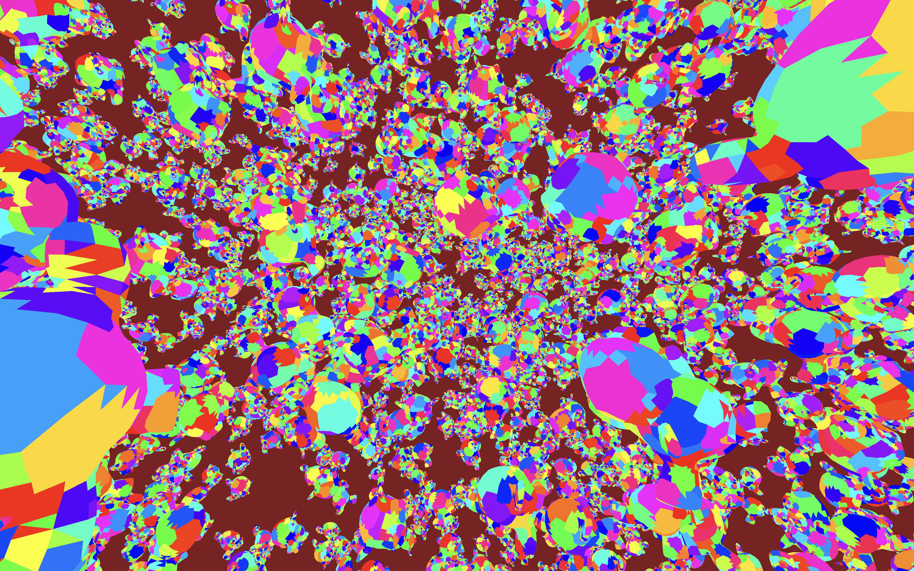
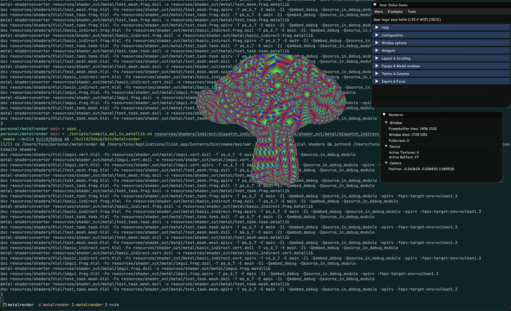

# Another Renderer

I've been working on this renderer to enlighten myself on the wonders
of the Metal, meshlets, RHIs, probably more when this README becomes out of date.

[Meshlet Occlusion Culling YouTube Demo](https://youtu.be/VtvOlOpG3P0?si=x588W3CFihpYrXrU)

## The deal

The main branch is an ongoing project with an render hardware interface (RHI) wrapping Metal and eventually Vulkan to enable a single renderer frontend to run on multiple platforms. The approach compiles HLSL with [DXC](https://github.com/microsoft/DirectXShaderCompiler) to either SPIRV directly for use with Vulkan, or `dxil`, which is converted directly to Metal IR using [metal-shaderconverter](https://developer.apple.com/metal/shader-converter/). After half-arsing abstractions in my previous renderer iterations, [VkRender2](https://github.com/tonadr1022/vkrender2) and [VulkanRenderer](https://github.com/tonadr1022/VulkanRenderer), it's incredibly satisfying to write a renderer without any "metal" or "vulkan" keywords.

The initial hard-coded Metal pipeline was written in Metal 3. I switched to Metal 4 for the first implementation of the RHI, only to realize it's practically unusable for anything beyond basic rendering due to a lack of GPU debugging support. I'm now supporting both Metal 3 and 4, since working without a GPU debugger/profiler is mega cursed. Update: I might be dropping Metal 3 out of laziness. Update 2: no more Metal 3 LOL.

The `pre_rhi` branch contains meshlet occlusion culling and primitive voxel rendering written in hardcoded Metal 3 as a learning experience.

Here's a lot of albedo only Sponzas culled aggresively (new RHI on Metal 4, M4 Pro):



Here's some out-of-date random Suzanne meshlets rendered with the old Metal 3 hard-coded pipeline:



Here's the first meshlet-rendered Suzanne with the new RHI, with a transparent window and [Comic Sans](https://en.wikipedia.org/wiki/Comic_Sans#Misuse) memery as a bonus:



## Running locally

```bash
git clone https://github.com/tonadr1022/metalrender
cd metalrender
git submodule update --init --recursive
cmake --preset Release
cmake --build build/Release --target metalrender # or vktest for the in-progress Vulkan test app

# Download glTF Sample Assets: https://github.com/KhronosGroup/glTF-Sample-Assets
./scripts/download_gltf_models.sh $HOME/gltf_sample_assets
# symlink so the default config file can find the models
ln -s $HOME/gltf_sample_assets/models/gltf ./resources/models/gltf
# run that thang
./build/Release/src/metalrender
```

## Current Features (probably out of date)

- RHI without API specific leaks
- GPU driven rendering (no for loops on the CPU, (looking at you MoltenVK))
- meshlets
- meshlet-level and object-level occlusion culling, frustum and cone culling
- dynamic model loading/unloading
- Other random niceties (CVars, object pools, etc)
- Half baked progress for Vulkan support, will continue with renewed access to Linux

## References

- [Mesh Shaders and Meshlet Culling in Metal 3](https://metalbyexample.com/mesh-shaders/)
- [Zeux's Niagara Renderer](https://github.com/zeux/niagara)
- [Metal Shading Language](https://developer.apple.com/metal/Metal-Shading-Language-Specification.pdf)
- [DirectX-Graphics-Samples](https://github.com/microsoft/DirectX-Graphics-Samples)
- [The Maister's Render Graph Deep Dive](https://themaister.net/blog/2017/08/15/render-graphs-and-vulkan-a-deep-dive/)
- [My previous Vulkan renderer VkRender2](https://github.com/tonadr1022/vkrender2)
- [WickedEngine](https://wickedengine.net/)

## Third Party Libraries

- [cgltf](https://github.com/jkuhlmann/cgltf)
- [glfw](https://github.com/glfw/glfw)
- [glm](https://github.com/g-truc/glm)
- [imgui](https://github.com/ocornut/imgui)
- [meshoptimizer](https://github.com/zeux/meshoptimizer)
- [metal-cpp](https://developer.apple.com/metal/cpp/)
- [metal-shaderconverter](https://developer.apple.com/metal/shader-converter/)
- [stb_image](https://github.com/nothings/stb)
- [tracy](https://github.com:wolfpld/tracy)
- [OffsetAllocator](https://github.com/sebbbi/OffsetAllocator)
- TODO: list the vulkan deps LOL

## Thoughts on AI Dev

Half the reason I'm writing this is for my own future reference when AI does or does not take over software dev more than it already has. During the first 6 months of work on this project, I purely hand-wrote code the artisan way in Neovim with at most Github Copilot for AI support. Then, after being exposed to the insanity of Claude Code and Cursor at work, I took the dive and got 6 months of Cursor for free. LLMs have improved substantially at graphics programming since the old days of pasting snippets into a textbox in the browser but don't seem to be at the level of fully taking over the artisan-hand-crafted approach. Thus, as of April 2026, I've moved to using Cursor Tab, which is pretty OP in itself, with Cursor agents and the occasional Codex prompt for simpler changes. I'm actively avoiding any possibility for this repo to become something that I didn't create or understand deeply. Who knows how much better coding agents will be in the future.

## TODO

- everything else
